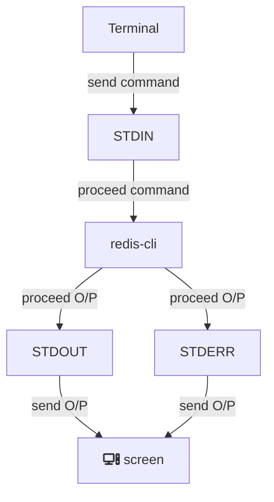

# create and run

```sh
docker run <image name>
```

- `docker` Reference the Docker client
- if the image is not there it will get the image from the hub
- create a container from the image
- start the container
  > **Warning**
  > Run for a short time then it will close.

# default command override

```sh
/* Run the container with the alternative command. */

docker run <image name> command
```

### Example

```sh
/* ls gives you all the files in the container. */

docker run busybox ls

/* echo hi gives hi in the terminal. */

docker run busybox echo hi

/* ping google.com help to run the program infinitely. */

docker run busybox ping google.com
```

```diff
+  run for long time `Cntrl + C` to stop
```

> **Warning**
> ls and echo are two programs inside the busybox file system if it's not it throws you an error.

# docker ps

```sh
/* List all running containers. */

docker ps

/* List all running containers that ever run in my machine. */

docker ps --all
```

> **Note**
> docker ps help to get the id of all containers.

# container lifecycle

```diff
+ docker run = ducker create + ducker start
```

```sh
/* Create a container. */

docker create <image name>

/* Start a container. */

docker start <container id>
```

> **Note** >`docker start` not gonna show you information coming out from the terminal, but `docker run` show you information coming out from the terminal.

```sh
/* Start a container with logs. */

docker start -a <container id>
```

<sub>"-a" watch for output from the container and give it to your terminal.</sub>

# Restarting Stopped Containers

- `docker ps --all` from this we can get the container id.
- `docker start -a <container id>` restart the stopped container.
  > **Warning**
  > We can not displace the default command.

# Removing Stopped Containers

```sh
/* delete stopped containers + networks not used by at least one container + all dangling images + all build cache */

docker system prune
```

# Retrieving Log Outputs

> **Note** > `docker start` is sometimes an expensive process it takes time. "-a" can't help you all time.

```sh
/* Getting a record of all the logs that have been emitted from the container(inspect the container) */

docker logs <container id>
```

# Stopping Containers

### ideal method :heavy_check_mark:

```sh
/* sent SIGTERM command to the container. */

docker stop <container id>
```

> It gives some time to the container to save some files or do some cleaning before shutdown.

```sh
/* sent SIGKILL command to the container. */

docker kill <container id>
```

> It shut down immediately

> **Warning**
> If the ping command `SIGTERM` is not going to shut down the container in `10sec` then docker falls back and ping command `SIGKILL`.

# Multi-Command Containers

## Executing commands in Running Containers

```sh
docker exec -it <container id> <command>
```

- `exec` Run another command.
- `-it` Allows us to Provide input to the container.
- `<container id>` ID of the container
- `<command>` Command to execute

### Example

> first terminal.

```sh
/* run Redis in one container */

docker run redis
```

> second terminal.

```sh
/* get the id of running Redis container */

docker ps

/* run another command in the same container */

docker exec -it f00035b5c219 redis-cli

/* try some command */

set myvalue 5

get myvalue // "5"
```

# The Purpose of the IT Flag



> **Note**
> Running processes are (ex:- `echo hi there` / `redis-cli`) created in a Linux environment
> It attaches to three communication channels.

```diff
@@ -it = -i + -t @@
```

- `-i` we execute this new command inside the container we want to attach our terminal to the standard in the channel of that new running process.
- `-t` all text from your terminal going out and coming in the show in a nice format on your screen.

# Getting a Command prompt in a container

```sh
/* getting a Command prompt in a container */

docker exec -it <container id> sh
```

> It is the name of a program. it's a program that is being executed inside the container.
> It is a command processor or a shell.
> It is something that allows us to type commands in and have them be executed inside that container

examples: -> `sh / bash / PowerShell

> **Note** >`ctrl + D`getting out from Command prompt in a container || type `exit`

# Starting with a Shell

```sh
/* run a single program with a shell */

docker run -it <image name> sh
```

# Container Location

```sh
/* create a new file in a container */

touch <file name>
```

```diff
+ Containers are separate and isolated from each other if we don't make a connection between them.
+ Also, containers can be from the same images but they contain different file systems.
```
